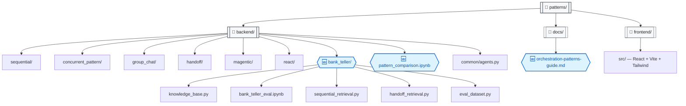

# Agent Patterns Sandbox — Evaluation & Guides

> **Based on**: [akshata29/agents](https://github.com/akshata29/agents) — Original Microsoft Agent Framework patterns repository.

---

## Repository Structure

> **🆕 = Added in this fork** — distinguished by hexagonal shape, blue border, and 🆕 icon (triple-encoded for accessibility).

---

## What This Fork Adds

This fork extends the original repo with evaluation tooling, customer-facing documentation, and a hands-on comparison project.

### 🏦 Bank Teller Knowledge Retrieval Eval (`patterns/backend/bank_teller/`)

A standalone project comparing **Sequential vs Handoff** orchestration patterns for a bank teller knowledge retrieval use case with role-based access control (IC vs Manager).

- **Synthetic Banking KB** — 16 articles across 8 domains (accounts, wires, disputes, lending, compliance, financials, HR, overrides) with role-gated access
- **Two pattern implementations** — Sequential pipeline (Analyze → Retrieve → Generate → Format) and Handoff pipeline (Router → Role gate → Domain specialist)
- **50-case evaluation dataset** — Simple lookups, role-gated queries, multi-domain, compliance-sensitive, and edge cases
- **Jupyter evaluation notebook** — Full eval pipeline with metrics dashboard (latency, routing precision, role adherence), optional Azure AI Evaluation SDK judges, and a recommendation engine

### 📊 Pattern Comparison Notebook (`patterns/backend/pattern_comparison.ipynb`)

Compares 5 orchestration patterns against the same banking fraud scenario using Azure AI Foundry persistent agents. Includes latency, quality, and cost metrics.

### 📖 Orchestration Patterns Guide (`patterns/docs/orchestration-patterns-guide.md`)

Comprehensive customer-facing document covering all 6 patterns with:
- Architecture diagrams and tradeoff matrices
- Decision framework flowchart
- Customer talk-track scripts for each pattern
- Pattern composition guidance

### 🛠️ Developer Experience

- `.github/copilot-instructions.md` — Project conventions, endpoint guidance, eval best practices
- Application Insights tracing integration
- Azure endpoint documentation (which endpoint goes where)

---

*For setup instructions, pattern details, and architecture — see the [original repo](https://github.com/akshata29/agents/tree/main/patterns).*
